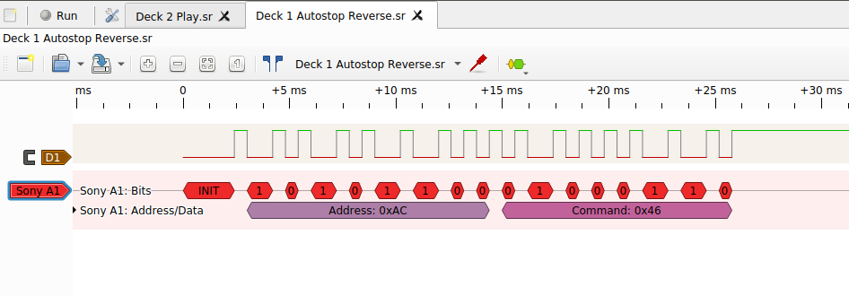

A protocol decoder module for use with the Sigrok logic analyzer backend library ( https://sigrok.org/ ), for use with the Sony A1 Control and A1ii Control serial bus protocols, used in Sony audio and home theater equipment.

Based on the reverse-engineering work of:

http://cegt201.bradley.edu/projects/proj2001/sonyntwk/SLink.PDF

and:

http://web.archive.org/web/20040722145551/http://www.undeadscientist.com/slink/encoding.html

Can in theory be used for Sony S-Link protocol, which is just A1 level-inverted, but I don't have hardware to test this with.